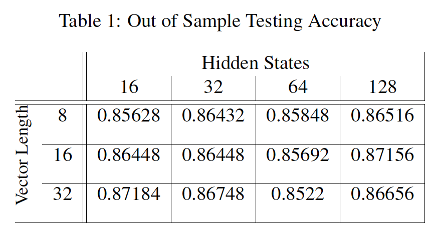

This dataset contains 25,000 movie reviews, labeled as either positive or negative. 
In this model we considered the 5000 most used words, and chunks of 500 word strings, and used this to find long-term dependencies inside the strings of words.

Using an embedding layer, then an LSTM layer (included in the Keras Sequential model package), and a final dense layer we found the following accuracies when we varied Hidden States and Vector Length:

Thus, all the Accuracies of the vectors and hidden states were in the range 85.2% to 87.2%, which is fairly high and indicates this LSTM model did a good job discerning whether a string of words had a good or bad sentiment. 
One thing that may improve computation time when running this model is the use of mini-batching. 
